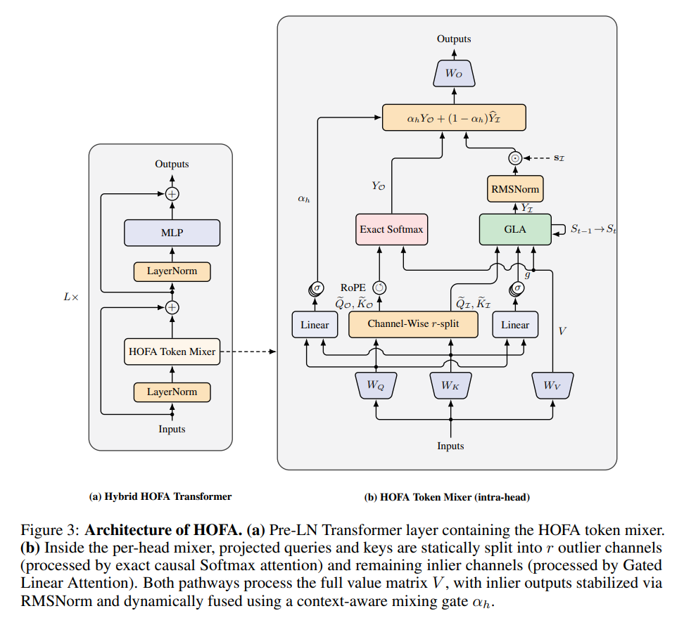

<div align="center">

# Hybrid Outlier-Factorized Attention (HOFA)

[](LICENSE)
[](https://pytorch.org)
[](#citation)

**Official PyTorch and Triton implementation of HOFA**

</div>

---

This repository contains the official codebase and hardware-optimized Triton decode kernels for **Hybrid Outlier-Factorized Attention (HOFA)**.

HOFA factorizes each attention head feature dimension into two complementary pathways:
- **Outlier Pathway** (first $r$ dimensions): Softmax FlashAttention with Rotary Position Embeddings (RoPE), acting as "IDs" for exact associative recall.
- **Inlier Pathway** (remaining $j = d_{\text{head}} - r$ dimensions): Gated Linear Attention (GLA), linearly processing the token content while decoupled from the recall pathway.

A learned token-level mixing gate $\alpha_h$ dynamically fuses the two pathways, providing context-aware allocation between exact recall and linear recurrence.

<p align="center">
  
</p>

---

## Quickstart

### Installation

```bash
git clone https://github.com/anonymous/HOFA.git
cd HOFA

# Install core dependencies & build native C++ extensions
bash install.sh
```
*(For environments without mamba-ssm C++ dependencies, use `bash install_no_mamba.sh`)*

---

## Reproduction Commands

```bash
# Profiling scripts
python main.py profile --prefill --no-use-cache
python main.py profile --decode --no-use-cache

# Pretrain HOFA & baseline models, and evaluate on zero-shot reasoning tasks
# 1. Select the desired model config in benchmarks/benchmarks_configs.py
python main.py train --download-data # Download & tokenize FineWeb-Edu data
python main.py train                 # Run distributed pretraining
python main.py train --eval          # Evaluate trained checkpoint

# Synthetic retrieval & capacity degradation benchmarks
python main.py benchmark --induction
python main.py benchmark --induction --plot
python main.py benchmark --induction-degradation
python main.py benchmark --induction-degradation --plot

# Additional synthetic & mechanistic benchmarks
python main.py benchmark --copy                 # Sequential copying capability
python main.py benchmark --copy --plot
python main.py benchmark --keff                 # K_eff probability mass distribution
python main.py benchmark --keff --plot
python main.py benchmark --distance             # Effective attention distance benchmark
python main.py benchmark --distance --plot
python main.py benchmark --alpha                # Gate distribution analysis

# Standalone zero-shot reasoning evaluation on trained checkpoints
python main.py eval --shared --scale 125M       # Evaluate 125M HOFA vs MHA
python main.py eval --shared --scale 350M       # Evaluate 350M HOFA vs MHA
python main.py eval --full --scale 350M         # Evaluate pretrained HF baselines

# Validate custom Triton decode kernel against PyTorch reference
python main.py infer --validate
```

---

## Repository Structure

* `src/`: Core PyTorch modules and fused Triton decode kernels (`fused_hofa_decode_kernel`).
* `training/`: FineWeb-Edu data loaders, distributed training loop, and plotting scripts.
* `benchmarks/`: Synthetic induction/copying tasks, $K_{\text{eff}}$ mass decomposition, and zero-shot reasoning benchmarks.
* `docs/`: Supplementary technical documentation and hardware optimization notes ([docs/DETAILS.md](docs/DETAILS.md)).

---

## Contributing

Contributions are welcome! Please submit a Pull Request. If you introduce a new feature or modify core kernels:
1. **Inference Validation**: Run `python main.py infer --validate` to verify numerical equivalence between PyTorch and Triton kernels.
2. **Profiling & Benchmarks**: Run relevant benchmarks (`python main.py profile --prefill` / `--decode` or synthetic benchmarks) demonstrating performance and stability.

---

## Citation

If you find HOFA useful in your research, please cite our paper:

```bibtex
@article{anonymous2026hofa,
  title   = {HOFA: Channel-Wise Hybrid Attention via Outlier Factorization},
  author  = {Anonymous Authors},
  journal = {Under review as a conference paper at ICLR 2027},
  year    = {2026}
}
```

---

## License

This project is licensed under the MIT License — see the [LICENSE](LICENSE) file for details.
